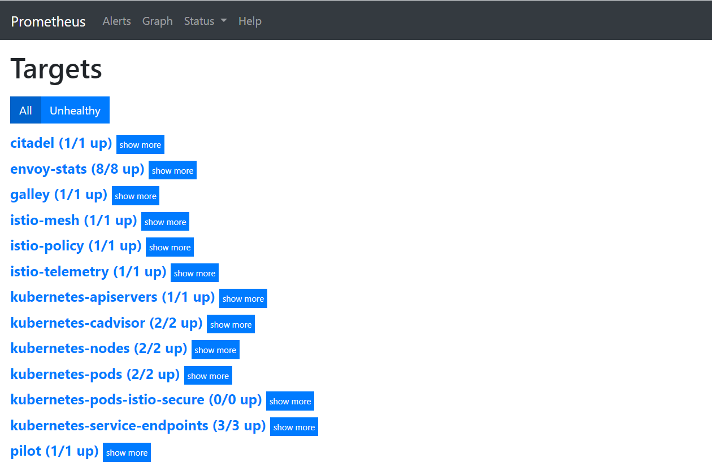
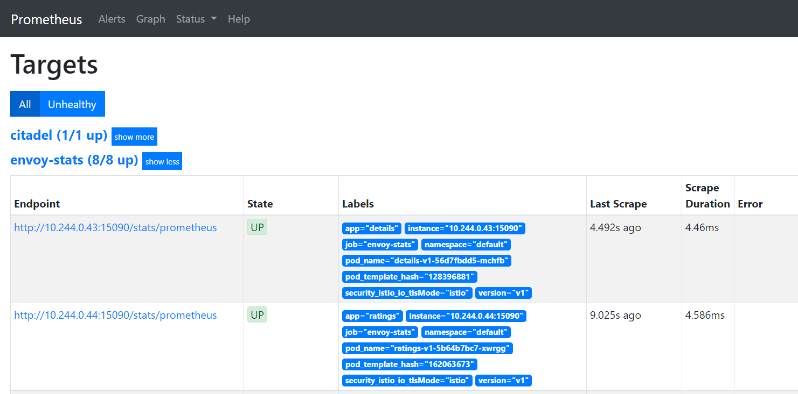

# Prometheus

## Prometheus简介
Prometheus是一款开源的、自带时序数据库的监控告警系统。目前，Prometheus已成为Kubernetes集群中监控告警系统的标配。Prometheus的架构如下图所示：


Prometheus通过规则对Kubernetes集群中的数据源做服务发现（Service Dicovery），再从数据源中抓取数据，存在它的时序数据库TSDB中。再根据配置的告警规则，触发告警条件后，将数据推给AlertManager服务，做告警服务的推送。同时，Prometheus中的数据也暴露了HTTP接口，通过PromQL（一种特定的查询语法）可以将收集的数据查出，并展示出来。

从上图可以看出，Prometheus主要从两种数据源抓取指标：PushGateway和Exporters。PushGateway指的是服务将指标数据主动推给PushGateway服务，Prometheus再异步从PushGateway服务中抓取。而Exporters则主动暴露了HTTP服务接口，Prometheus定时从接口中抓取指标。

在istio中，各个组件是通过暴露HTTP接口的方式让Prometheus定时抓取的（采用了Exporters的方式）。在Kubernetes集群中，istio安装完成后，会在istio-system的namespace中部署Prometheus，并将istio组件各相关指标的数据源默认配置在Prometheus中。

打开Prometheus页面，在导航栏输入/targets上下文查看Prometheus通过服务发现得到的指标数据源：

```bash
http://<Prometheus URL>/targets

```



点开其中的envoy-stats，可以看到该数据源中有Endpoint、State、Labels、Last Scrape、Scrape Duration、Error六列：

 - Endpoint：抓取指标的地址
 - State：该指标接口能否正常提供数据（UP代表正常，DOWN代表指标服务异常）
 - Labels：该指标所带的标签，用于标识指标，如下图中的第一行指标：该集群中default这个namespace下pod名为details-v1-56d7fbdd5-mchfb的envoy-stats指标，根据Target名字我们可以猜测，这是用于查询pod的envoy容器状态的指标
 - Last Scrape：Prometheus最后一次从数据源中抓取指标的时间到当前的时间间隔
 - Scrape Duration：Prometheus调该接口抓取指标的耗时
 - Error：错误数


在集群中可以直接访问上图中envoy-stats这个target中第一行的Endpoint URL（URL中的IP为Pod在集群中的IP，因此在集群外部无法访问），得到Prometheus格式的指标数据

```bash
$ curl http://10.244.0.43:15090/stats/prometheus
# TYPE envoy_tcp_mixer_filter_total_remote_call_successes counter
envoy_tcp_mixer_filter_total_remote_call_successes{} 0
# TYPE envoy_tcp_mixer_filter_total_remote_check_calls counter
envoy_tcp_mixer_filter_total_remote_check_calls{} 0
# TYPE envoy_tcp_mixer_filter_total_remote_call_send_errors counter
envoy_tcp_mixer_filter_total_remote_call_send_errors{} 0
# TYPE envoy_tcp_mixer_filter_total_quota_calls counter
envoy_tcp_mixer_filter_total_quota_calls{} 0
# TYPE envoy_tcp_mixer_filter_total_remote_report_successes counter
envoy_tcp_mixer_filter_total_remote_report_successes{} 0
# TYPE envoy_cluster_client_ssl_socket_factory_ssl_context_update_by_sds counter
envoy_cluster_client_ssl_socket_factory_ssl_context_update_by_sds{cluster_name="outbound|15004||istio-policy.istio-system.svc.cluster.local"} 0
# TYPE envoy_listener_server_ssl_socket_factory_ssl_context_update_by_sds counter
envoy_listener_server_ssl_socket_factory_ssl_context_update_by_sds{listener_address="[fe80__48ad_9ff_feee_915f]_9080"} 0

```
Prometheus格式的指标数据由两行组成：
- 第一行以#号开头，是对指标的说明，包括指标名、指标类型
- 第二行为指标具体的数据，包括指标名、当前采集到的指标值，指标名后面的花括号则标识指标带有的Label标签，例如要查询envoy_cluster_client_ssl_socket_factory_ssl_context_update_by_sds这个指标中Label为listener_address="10.244.0.43_9080"的数据，打开Promehteus的Graph界面，输入以下PromQL语句，点击Execute查询即可

```
envoy_listener_server_ssl_socket_factory_ssl_context_update_by_sds{listener_address="10.244.0.43_9080"}
```

以上是Prometheus的简介和基本用法

## Prometheus基本配置
## Istio中Prometheus的指标
