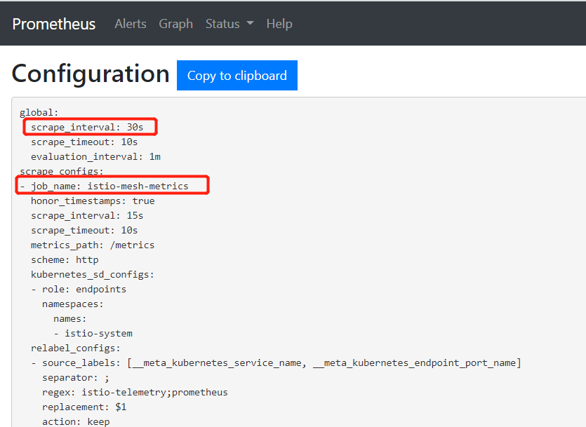
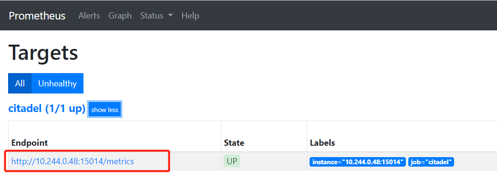
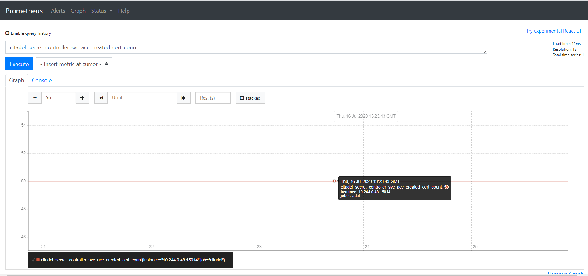
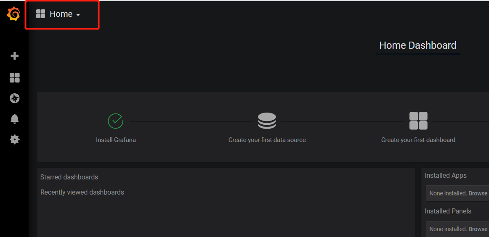
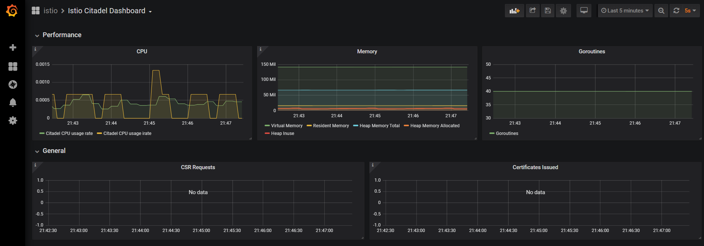
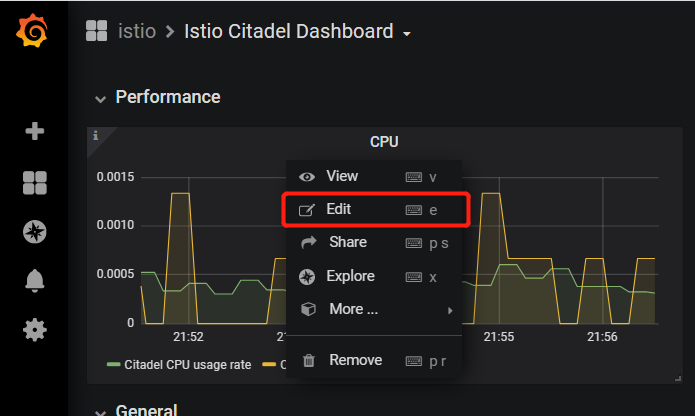
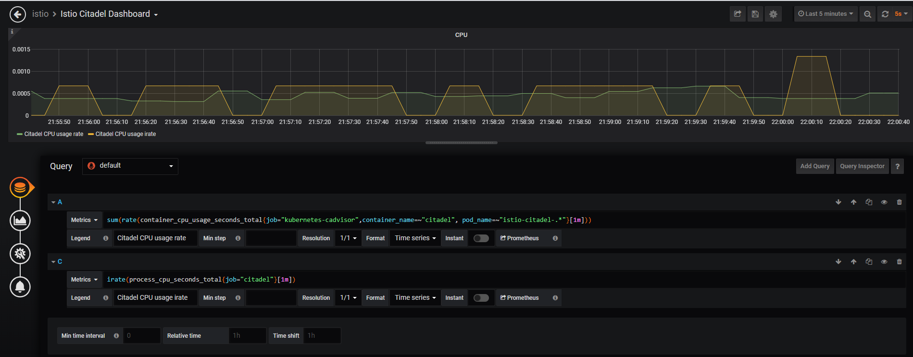
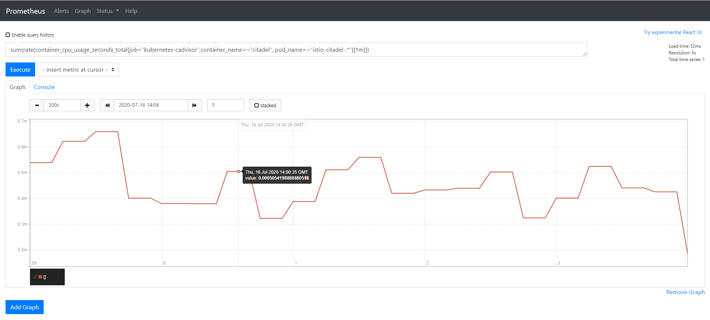

# Prometheus

## Prometheus 简介
Prometheus 是一款开源的、自带时序数据库的监控告警系统。目前，Prometheus 已成为 Kubernetes 集群中监控告警系统的标配。Prometheus 的架构如下图所示：


图片来源：[Prometheus 官方文档](https://prometheus.io/docs/introduction/overview/)

Prometheus 通过规则对 Kubernetes 集群中的数据源做服务发现（Service Dicovery），再从数据源中抓取数据，保存在它的时序数据库 TSDB 中。再根据配置的告警规则，将数据推给 AlertManager 服务，做告警信息的推送。同时，Prometheus 中也暴露了 HTTP 指标查询接口，通过 PromQL（一种特定的查询语法）可以将收集的数据查询并展示出来。

从上图可以看出，Prometheus 主要从两种数据源抓取指标：PushGateway 和 Exporters。PushGateway 指的是服务将指标数据主动推给 PushGateway 服务，Prometheus 再异步从 PushGateway 服务中抓取。而 Exporters 则主动暴露了 HTTP 服务接口，Prometheus 定时从接口中抓取指标。

在 Istio 中，各个组件是通过暴露 HTTP 接口的方式让 Prometheus 定时抓取的（采用了 Exporters 的方式）。在 Kubernetes 集群中，Istio 安装完成后，会在 istio-system 的命名空间中部署 Prometheus，并将 Istio 组件各相关指标的数据源默认配置在 Prometheus 中。

打开 Prometheus 页面，在导航栏输入 /targets 上下文查看 Prometheus 通过服务发现得到的指标数据源：

```bash
http://<Prometheus URL>:9090/targets

```


点开其中的 envoy-stats，可以看到该数据源中有 Endpoint、State、Labels、Last Scrape、Scrape Duration、Error 六列：

 - Endpoint：抓取指标的地址；
 - State：该指标接口能否正常提供数据（UP代表正常，DOWN代表指标服务异常）；
 - Labels：该指标所带的标签，用于标识指标，如下图中的第一行指标：该集群中 default 这个命名空间下 pod 名为 details-v1-56d7fbdd5-mchfb 的 envoy-stats 指标，根据 Target 名字我们可以猜测，这是用于查询 Pod 的 envoy 容器状态的指标；
 - Last Scrape：Prometheus 最后一次从数据源中抓取指标的时间到当前的时间间隔；
 - Scrape Duration：Prometheus 调该接口抓取指标的耗时；
 - Error：获取数据源信息失败的原因；


在集群中可以直接访问上图中 envoy-stats 这个 target 中第一行的 Endpoint URL（URL中的IP为Pod在集群中的 IP，因此在集群外部无法访问），得到如下 Prometheus 格式的指标数据：

```bash
$ curl http://10.244.0.43:15090/stats/prometheus
# TYPE envoy_tcp_mixer_filter_total_remote_call_successes counter
envoy_tcp_mixer_filter_total_remote_call_successes{} 0
# TYPE envoy_tcp_mixer_filter_total_remote_check_calls counter
envoy_tcp_mixer_filter_total_remote_check_calls{} 0
# TYPE envoy_tcp_mixer_filter_total_remote_call_send_errors counter
envoy_tcp_mixer_filter_total_remote_call_send_errors{} 0
# TYPE envoy_tcp_mixer_filter_total_quota_calls counter
envoy_tcp_mixer_filter_total_quota_calls{} 0
# TYPE envoy_tcp_mixer_filter_total_remote_report_successes counter
envoy_tcp_mixer_filter_total_remote_report_successes{} 0
# TYPE envoy_cluster_client_ssl_socket_factory_ssl_context_update_by_sds counter
envoy_cluster_client_ssl_socket_factory_ssl_context_update_by_sds{cluster_name="outbound|15004||istio-policy.istio-system.svc.cluster.local"} 0
# TYPE envoy_listener_server_ssl_socket_factory_ssl_context_update_by_sds counter
envoy_listener_server_ssl_socket_factory_ssl_context_update_by_sds{listener_address="[fe80__48ad_9ff_feee_915f]_9080"} 0

```
Prometheus 格式的指标数据由两行组成：
- 第一行以#号开头，是对指标的说明，包括指标名、指标类型；
- 第二行为指标具体的数据，一行代表一个监控项，以Key-Value形式返回。Key为指标名，Value为指标值，指标名后面的花括号则标识指标带有的标签（Label），例如要查询 envoy_cluster_client_ssl_socket_factory_ssl_context_update_by_sds 这个指标中标签为 listener_address，且标签值为10.244.0.43_9080的数据，打开 Promehteus 的 Graph 界面，输入以下 PromQL 语句，点击 Execute 查询即可筛选出匹配的数据（PromQL 是一种查询 Prometheus 指标数据的语法）；

```
envoy_listener_server_ssl_socket_factory_ssl_context_update_by_sds{listener_address="10.244.0.43_9080"}
```


## Prometheus 基本配置

在 Istio 安装完成后，其自带的 Prometheus 已经能够从各 Istio 组件中正常抓取指标数据了，为什么 Pormetheus 能够采集到 Istio 各组件的指标数据呢？答案就在 Prometheus 的配置文件中。
Kubernetes 集群中的 Prometheus 配置信息以 ConfigMap 的形式挂载在 Prometheus 所在 Pod 的 /etc/prometheus 目录下。

```bash
$ kubectl exec -it prometheus-7cb88b5945-8jbkf -n istio-system sh
/prometheus $ ls /etc/prometheus/
prometheus.yml
```
打开 prometheus.yml 查看 Prometheus 的配置（也可以直接打开 istio-system 命名空间下的名为 Prometheus 的 ConfigMap 查看）。

```bash
/prometheus $ vi /etc/prometheus/prometheus.yml
global:
  scrape_interval: 15s
scrape_configs:

# Mixer scrapping. Defaults to Prometheus and mixer on same namespace.
#
- job_name: 'istio-mesh'
  kubernetes_sd_configs:
  - role: endpoints
    namespaces:
      names:
      - istio-system
  relabel_configs:
  - source_labels: [__meta_kubernetes_service_name, __meta_kubernetes_endpoint_port_name]
    action: keep
    regex: istio-telemetry;prometheus

# Scrape config for envoy stats
- job_name: 'envoy-stats'
  metrics_path: /stats/prometheus
  kubernetes_sd_configs:
  - role: pod

  relabel_configs:
  - source_labels: [__meta_kubernetes_pod_container_port_name]
    action: keep
    regex: '.*-envoy-prom'
  - source_labels: [__address__, __meta_kubernetes_pod_annotation_prometheus_io_port]
    action: replace
    regex: ([^:]+)(?::\d+)?;(\d+)
    replacement: $1:15090
    target_label: __address__  
    ...
```
由于配置文件太长，这里截取了开头的一部分。我们发现 Prometheus 中已经帮我们配置好了从 Istio 组件中抓取指标数据的各项配置规则，那么这些配置具体是什么意思呢？
Prometheus 的配置文件主要由一下几部分组成：

- global：全局配置，比如指标的采样间隔、指标的抓取超时时间等；
- scrape_configs：抓取指标的数据源配置，称为 target，每个 target 用 job_name 命名。有静态配置和服务发现两种配置方式；
- rule_files：指定告警规则文件，Prometheus 根据这些规则，将匹配的告警信息推送到 alertmanager 中；
- alerting：告警配置， 这里主要是指定 Prometheus 将报警信息推送到具体哪一个 alertmanager 实例地址；
- remote_write：指定后端的存储的写入 api 地址；
- remote_read：指定后端的存储的读取 api 地址；

这里主要关注前两个配置：global 和 scrape_configs。以上文提到的 Istio 的 Prometheus 配置为例：

```yaml
# 这里指定了 Prometheus 全局的采样间隔为15秒
global:
  scrape_interval: 15s
scrape_configs:
# 这是一个名为istio-mesh的target
- job_name: 'istio-mesh'
  # 这里配置 Prometheus 的服务发现规则：发现 Kubernetes 集群中 istio-system 命名空间下的所有 endpoint
  kubernetes_sd_configs:
  - role: endpoints
    namespaces:
      names:
      - istio-system
  # 在 Prometheus 抓取指标前做一些内置标签的聚合或去除操作：这里把标签值分别为 istio-telemetry 和 prometheus 的内置标签 __meta_kubernetes_service_name 和 __meta_kubernetes_endpoint_port_name 保留下来，其它的内置标签则丢弃
  relabel_configs:
  - source_labels: [__meta_kubernetes_service_name, __meta_kubernetes_endpoint_port_name]
    action: keep
    regex: istio-telemetry;prometheus
# 这是一个名为 envoy-stats 的 target
- job_name: 'envoy-stats'
  metrics_path: /stats/prometheus
  # 这里配置 Prometheus 的服务发现规则：发现 Kubernetes 集群中所有命名空间下的所有 pod
  kubernetes_sd_configs:
  - role: pod
  # 在 Prometheus 抓取指标前做一些内置标签的聚合或去除操作
  relabel_configs:
  # 这里把标签值为 -envoy-prom 结尾的内置标签 __meta_kubernetes_pod_container_port_name 保留下来
  - source_labels: [__meta_kubernetes_pod_container_port_name]
    action: keep
    regex: '.*-envoy-prom'
  # 这里把标签值分别匹配([^:]+)(?::\d+)?和(\d+)正则表达式的内置标签 __address__ 和 __meta_kubernetes_pod_annotation_prometheus_io_port 合并成 __address__:15090 的格式，替换掉原来的 __address__ 标签值
  - source_labels: [__address__, __meta_kubernetes_pod_annotation_prometheus_io_port]
    action: replace
    regex: ([^:]+)(?::\d+)?;(\d+)
    replacement: $1:15090
    target_label: __address__  
```
配置文件中提到的内置标签替换是怎么回事呢？我们先回到 Prometheus 的 targets 页面，把鼠标指针放在 Labels 列中的蓝色标签上，发现弹出了一些以双下划线开头的标签，这就是上面所提到的内置标签。因为 Prometheus 天然兼容 Kubernetes，当它部署在 Kubernetes 集群中，且通过 kubernetes_sd_configs 这种方式配置服务发现时，会默认给各指标加上 Kubernetes 相关的内置标签，如：该指标服务所在的计算节点名、Pod IP、命名空间、暴露的端口等。


总而言之，在 Istio 中，Prometheus 通过配置中的每个 target（job_name）的服务发现规则，找到 Kubernetes 集群中的指标数据源，再根据 relabel_configs 配置做内置标签的去除、聚合等操作，得到最终的指标数据。
此外，我们可以通过修改 Prometheus 的 ConfigMap 对其配置进行如下修改：

```bash
$ kubectl edit configmap prometheus -n istio-system
apiVersion: v1
data:
  prometheus.yml: |-
    global:
      # 这里将采样间隔改为30s
      scrape_interval: 30s
    scrape_configs:
    # 这里将job_name改为istio-mesh-metrics
    - job_name: 'istio-mesh-metrics'
      kubernetes_sd_configs:
      - role: endpoints
        namespaces:
          names:
          - istio-system
      relabel_configs:
      - source_labels: [__meta_kubernetes_service_name, __meta_kubernetes_endpoint_port_name]
        action: keep
        regex: istio-telemetry;prometheus
    ...
```

修改完成后保存，Prometheus 的配置支持热更新，我们只需要给 Prometheus 加上 --web.enable-lifecycle 启动参数：


```bash

$ kubectl edit deployment prometheus -n istio-system
 ...
 containers:
      - args:
        - --storage.tsdb.retention=6h
        
        - --config.file=/etc/prometheus/prometheus.yml
        
        - --web.enable-lifecycle
          image: docker.io/prom/prometheus:v2.15.1
          imagePullPolicy: IfNotPresent
 ...

```


然后再调用 Prometheus 的 HTTP API 即可更新配置：

```bash
$ curl -X POST http://<Prometheus URL>:9090/-/reload
```
打开 Prometheus 的 config 页面检查配置是否生效：
```bash
http://<Prometheus URL>/config
```



本小节主要介绍了 Kubernetes 集群中 Prometheus 的基本配置，以及解释了在 Istio 安装完成后，其自带的 Pormetheus 默认对 Istio 各组件做了服务发现、指标标签修改等配置，最后演示了如何对 Prometheus 的配置做修改和热更新。

## Prometheus 中 Istio 的相关指标

我们回到最开始提到的 Promehteus 的 targets 页面：


从上图中可以看到 Prometheus 通过服务发现，得到了不少监控指标的数据源（Targets），其中 kubernetes 开头的为 Kubernetes 集群相关的指标，如：kubernetes-apiservers 提供了 apiServer 相关指标、kubernetes-nodes 提供了集群中计算节点的相关指标、kubernetes-pods 提供了集群中 Pod 的相关指标、kubernetes-cadivisor 提供了集群节点中容器相关的性能指标数据。

除去 Kubernetes 集群相关的指标，剩下的就是 Istio 各组件相关的指标了。以下每个组件暴露的指标都包含了该组件运行时进程所占内存、cpu、文件描述符等状态信息，除此之外，还提供了各组件采集到的特定指标：

- citadel：citadel 组件的相关指标，如：citadel 的 go 进程 gc 时间、证书签名请求（CSR）、证书颁发等相关指标；
- envoy-stats：sidecar 容器中 envoy 组件采集到的相关指标（网格中服务间的调用拓扑关系等）；
- galley：galley 组件的相关指标，如：galley 的  go 进程 gc 时间、网络通信等相关指标；
- istio-mesh-metrics：telemetry 组件采集到的网格中服务间通信的网络相关指标；
- istio-policy 和 istio-telemetry：这两个指标都来自 Mixer 服务的两个组件：policy 和 telemetry。都提供了组件的 go 进程 gc 时间、Mixer 服务、网络通信等相关指标；
- pilot：pilot 组件的相关指标，如：pilot 的  go 进程 gc 时间、网络通信等相关指标；

我们可以通过直接访问各组件暴露的 metrics 接口来获取指标信息。例如想要获取 citadel 组件的指标，先找到 citadel 组件的 metrics 地址，然后在集群中用 curl 命令访问：




```bash
$ curl http://10.244.0.48:15014/metrics
# HELP citadel_secret_controller_svc_acc_created_cert_count The number of certificates created due to service account creation.
# TYPE citadel_secret_controller_svc_acc_created_cert_count counter
citadel_secret_controller_svc_acc_created_cert_count 50
# HELP citadel_server_root_cert_expiry_timestamp The unix timestamp, in seconds, when Citadel root cert will expire. We set it to negative in case of internal error.
# TYPE citadel_server_root_cert_expiry_timestamp gauge
citadel_server_root_cert_expiry_timestamp 1.909062314e+09
# HELP go_gc_duration_seconds A summary of the GC invocation durations.
# TYPE go_gc_duration_seconds summary
go_gc_duration_seconds{quantile="0"} 1.0386e-05
go_gc_duration_seconds{quantile="0.25"} 1.427e-05
go_gc_duration_seconds{quantile="0.5"} 1.6094e-05
go_gc_duration_seconds{quantile="0.75"} 1.8008e-05
go_gc_duration_seconds{quantile="1"} 7.5778e-05
go_gc_duration_seconds_sum 0.160016613
go_gc_duration_seconds_count 7935
# HELP go_goroutines Number of goroutines that currently exist.
# TYPE go_goroutines gauge
go_goroutines 41
...

```

我们可以看到 citadel 组件提供的指标中创建证书和 go 进程相关的指标数据，指标的格式上文中已有说明，这里不再赘述。

我们通过访问各组件暴露的 metrics 接口得到了指标的名字、标签和值。可以在 Prometheus 页面中根据条件查询指标当前时刻以及历史时刻的值，以 citadel_secret_controller_svc_acc_created_cert_count （由于创建服务帐户而创建的证书数量）这个指标为例，在页面中输入带有指标名的 PromQL 查询语句，选择Graph标签和距离当前时间的时间间隔（这里选择了5分钟），点击 Excute 查询最近5分钟内由于创建服务帐户而创建的证书数量变化图：



手动在 Prometheus 中输入指标名查询指标的值看起来很方便，但在 Istio 中有上百个指标，一个一个查询显得非常繁琐，有没有更加便捷的方式从 Prometheus 中获取到我们想要的数据呢？答案是肯定的，Istio 安装时帮我们装了一款大规模指标数据的可视化展现工具——Grafana，它通过采集 Prometheus 提供的指标数据，绘制成可视化的面板，大大提高了指标数据的可读性。关于它的详细介绍和使用方式在 Grafana 的章节中会有说明，这里简单带大家体验一下。

我们打开 Grafana 页面，点击左上角的 Home 按钮查看名为 Istio 组下的面板：




在 Istio 组中有8块面板（Dashboard），分别对应了上文在 Prometheus 中看到的 Istio 相关组件的指标信息，我们选择其中的 Istio Citadel Dashboard 查看具体的面板信息，发现 Citadel 相关指标信息都以图表的形式展示了出来。



那么要怎么根据图表找到对应的 Prometheus 指标和查询语句呢？以上图的第一个面板 CPU 为例，点击面板中的 CPU 标题，出现下拉框，点击 Edit 按钮。



跳转到了编辑页，这里可以对图表的查询条件、面板属性进行编辑，我们看到页面的下半部分就是对应的 Prometheus 指标查询语句。



点击查询语句输入框下方的的 Prometheus 按钮，即可跳转到对应的 Promehteus 查询页面。



以上就是 Prometheus 在 Istio 中的应用，Isito 各组件通过 HTTP 的形式暴露了 Prometheus 格式的指标数据抓取接口，Prometheus 通过配置对 Istio 各组件的服务发现和采集规则实现对其指标的采集，同时作为数据源提供给了 Grafana、Kiali 这样的可视化工具做数据展示。

## 参考

- [istio 官方文档](https://istio.io/latest/docs/reference/commands/)
- [overview - prometheus.io](https://prometheus.io/docs/introduction/overview/)


